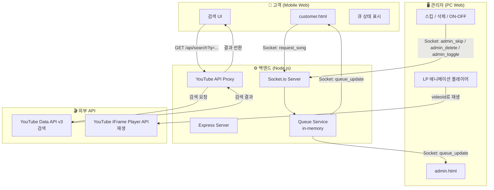
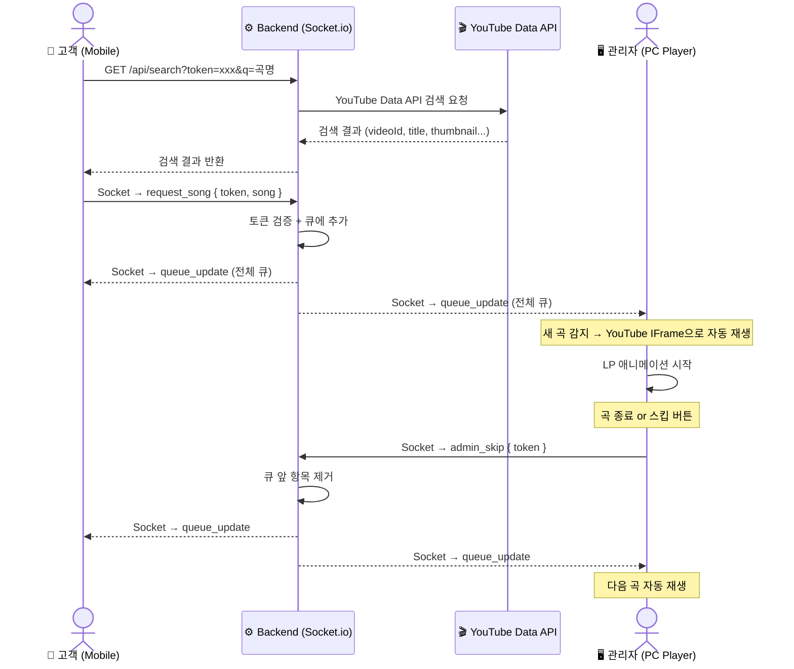
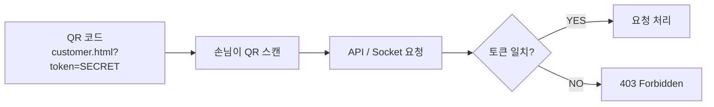

# ☕ Caffeine Flow

> 카페 손님이 QR 코드를 스캔해 음악을 신청하고, 관리자 화면에서 실시간으로 재생되는 카페 뮤직 리퀘스트 시스템

---

## 목차

- [주요 기능](#주요-기능)
- [시스템 아키텍처](#시스템-아키텍처)
- [기술 스택](#기술-스택)
- [시작하기](#시작하기)
- [화면 구성](#화면-구성)
- [보안](#보안)
- [향후 계획](#향후-계획)

---

## 주요 기능

| 기능 | 설명 |
|------|------|
| 🔍 곡 검색 | YouTube Data API를 통해 원하는 곡 검색 |
| 🎵 음악 신청 | 검색 결과에서 곡을 선택해 큐에 추가 |
| 📡 실시간 동기화 | Socket.io로 신청 즉시 모든 화면에 반영 |
| 💿 LP 애니메이션 | 재생 중 회전하는 LP판 + 앨범아트 표시 |
| ⏭ 스킵 / 삭제 | 관리자가 곡을 강제 스킵하거나 큐에서 제거 |
| 🔛 시스템 ON/OFF | 신청 기능을 즉시 켜고 끄기 |
| 🔒 토큰 보안 | QR URL 토큰으로 외부 악의적 접근 차단 |
| 🔁 자동 재생 | 곡 종료 시 자동으로 다음 신청 곡 재생 |

---

## 시스템 아키텍처

### 전체 구조



---

### 실시간 데이터 흐름 (Sequence)



---

### 보안 토큰 흐름



---

## 기술 스택

| 분류 | 기술 |
|------|------|
| **런타임** | Node.js |
| **서버 프레임워크** | Express |
| **실시간 통신** | Socket.io (WebSocket) |
| **프론트엔드** | Vanilla HTML/CSS/JS (모바일 최적화) |
| **음악 검색** | YouTube Data API v3 |
| **음악 재생** | YouTube IFrame Player API |
| **큐 저장소** | In-memory (서버 재시작 시 초기화) |

---

## 시작하기

### 1. 저장소 클론

```bash
git clone https://github.com/sngmng6506/caffeine-Flow.git
cd caffeine-Flow
```

### 2. 의존성 설치

```bash
npm install
```

### 3. 환경변수 설정

```bash
cp .env.example .env
```

`.env` 파일을 열어 값을 입력합니다:

```env
PORT=3000
CAFE_TOKEN=your-secret-token    # QR URL에 포함될 비밀 토큰
YOUTUBE_API_KEY=your-api-key    # Google Cloud Console에서 발급
```

> **YouTube API 키 발급:** [Google Cloud Console](https://console.cloud.google.com) → YouTube Data API v3 활성화 → 사용자 인증 정보 → API 키 생성

### 4. 서버 실행

```bash
# 일반 실행
node server.js

# 개발 모드 (코드 변경 시 자동 재시작)
npm run dev
```

### 5. 접속

서버 시작 시 콘솔에 URL이 출력됩니다:

```
🎵 Cafe Music Server running on http://localhost:3000
   Token: your-secret-token
   Customer QR URL: http://localhost:3000/customer.html?token=your-secret-token
   Admin URL:       http://localhost:3000/admin.html?token=your-secret-token
```

| 역할 | URL |
|------|-----|
| **관리자** | `http://서버IP:3000/admin.html?token=토큰` |
| **고객 QR** | `http://서버IP:3000/customer.html?token=토큰` |

> 실제 카페 환경에서는 `서버IP` 자리에 PC의 로컬 IP(예: `192.168.0.10`)를 사용합니다.

---

## 화면 구성

### 고객 화면 (Mobile)
- 곡명 / 아티스트 검색
- 검색 결과에서 신청 버튼 클릭
- 현재 신청 목록 실시간 확인
- 시스템 OFF 시 신청 불가 안내

### 관리자 화면 (PC)
- LP판 애니메이션 + 현재 재생 곡 정보
- YouTube 플레이어 (자동 재생)
- 전체 신청 큐 목록
- 스킵 / 개별 삭제 / 시스템 ON·OFF 버튼

---

## 보안

- QR URL에 포함된 `token` 값을 서버에서 검증
- API 키는 서버에서만 사용 (클라이언트에 노출되지 않음)
- `.env` 파일은 `.gitignore`에 포함되어 Git에 업로드되지 않음

---

## 향후 계획

- [ ] 1인당 신청 곡 수 제한 (IP 기반 rate limiting)
- [ ] 테이블별 고유 QR 코드 생성
- [ ] 좋아요 / 투표 기반 큐 정렬
- [ ] Redis를 이용한 큐 영속성 (서버 재시작 후 복구)
- [ ] 신청 이력 저장 및 통계
