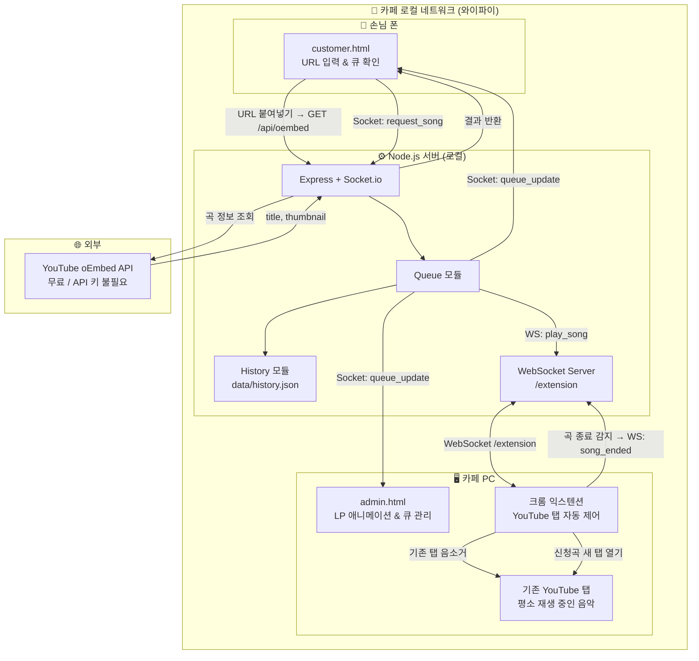
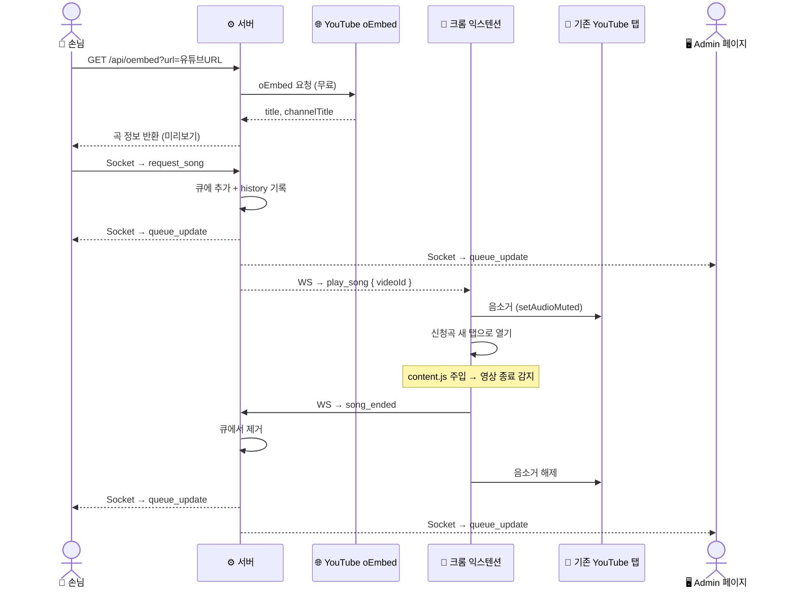
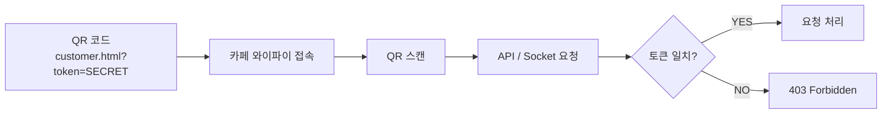

# ☕ Caffeine Flow

> 카페 손님이 카페 와이파이에 접속 후 QR 코드를 스캔해 음악을 신청하면, 카페 PC의 YouTube가 자동으로 전환되는 뮤직 리퀘스트 시스템

---

## 목차

- [주요 기능](#주요-기능)
- [시스템 아키텍처](#시스템-아키텍처)
- [프로젝트 구조](#프로젝트-구조)
- [기술 스택](#기술-스택)
- [시작하기](#시작하기)
- [크롬 익스텐션 설치](#크롬-익스텐션-설치)
- [화면 구성](#화면-구성)
- [보안](#보안)
- [향후 계획](#향후-계획)

---

## 주요 기능

| 기능 | 설명 |
|------|------|
| 🔗 URL 신청 | YouTube URL 붙여넣기 → 자동으로 곡 정보 조회 후 신청 |
| 📡 실시간 동기화 | Socket.io로 신청 즉시 모든 화면에 반영 |
| 🎬 자동 탭 제어 | 신청곡 재생 시 기존 YouTube 탭 자동 음소거 |
| 🔁 자동 재생 | 곡 종료 시 자동으로 다음 신청 곡 재생 후 원래 음악 복원 |
| 💿 LP 애니메이션 | Admin 페이지에서 재생 중 회전하는 LP판 + 앨범아트 표시 |
| ⏭ 스킵 / 삭제 | 관리자가 곡을 강제 스킵하거나 큐에서 제거 |
| 🔛 시스템 ON/OFF | 손님 신청 기능을 즉시 켜고 끄기 |
| 🔒 토큰 보안 | QR URL 토큰으로 카페 와이파이 외부 접근 차단 |
| 📊 이력 & 통계 | 재생 이력 저장, TOP 10 신청곡, 시간대별 통계 |

---

## 시스템 아키텍처

### 전체 구조



---

### 신청부터 재생까지 (Sequence)



---

### 보안 토큰 흐름



> 서버가 로컬 IP(`192.168.x.x`)에서만 실행되므로 카페 와이파이에 연결된 기기만 접근 가능합니다.

---

## 프로젝트 구조

```
caffeine-Flow/
├── server.js              # 진입점
├── src/
│   ├── config.js          # 환경변수
│   ├── state.js           # 공유 상태 (queue, isPlaying 등)
│   ├── queue.js           # 큐 로직 (추가/스킵/삭제/재생)
│   ├── history.js         # 이력 저장 & 통계
│   ├── api.js             # REST API 라우터
│   ├── socket.js          # Socket.io 이벤트 핸들러
│   └── extension.js       # 익스텐션 WebSocket 서버
├── public/
│   ├── customer.html      # 손님 모바일 페이지
│   └── admin.html         # 관리자 페이지 (큐/이력/통계)
├── extension/
│   ├── manifest.json      # 크롬 익스텐션 설정
│   ├── background.js      # YouTube 탭 제어 핵심 로직
│   ├── content.js         # 영상 종료 감지 (신청곡 탭에 주입)
│   ├── popup.html         # 익스텐션 팝업 UI
│   └── popup.js           # 서버 설정 & 연결 상태 표시
├── data/
│   └── history.json       # 재생 이력 (자동 생성, git 제외)
└── .env                   # 환경변수 (git 제외)
```

---

## 기술 스택

| 분류 | 기술 |
|------|------|
| **런타임** | Node.js |
| **서버 프레임워크** | Express |
| **실시간 통신** | Socket.io (WebSocket) |
| **익스텐션 통신** | WebSocket (ws) |
| **프론트엔드** | Vanilla HTML/CSS/JS |
| **곡 정보 조회** | YouTube oEmbed API (무료, API 키 불필요) |
| **음악 재생** | 카페 PC의 YouTube 탭 (Premium 유지) |
| **이력 저장** | JSON 파일 (`data/history.json`) |
| **브라우저 제어** | Chrome Extension (Manifest V3) |

---

## 시작하기

### 1. 저장소 클론

```bash
git clone https://github.com/sngmng6506/caffeine-Flow.git
cd caffeine-Flow
```

### 2. 의존성 설치

```bash
npm install
```

### 3. 환경변수 설정

```bash
cp .env.example .env
```

`.env` 파일 수정:

```env
PORT=3000
CAFE_TOKEN=your-secret-token    # QR URL에 포함될 비밀 토큰
```

### 4. 서버 실행

```bash
# 일반 실행
node server.js

# 개발 모드 (코드 변경 시 자동 재시작)
npm run dev
```

### 5. 접속 URL

서버 시작 시 콘솔에 출력됩니다:

```
🎵 Caffeine Flow running on http://localhost:3000
   Customer: http://localhost:3000/customer.html?token=your-secret-token
   Admin:    http://localhost:3000/admin.html?token=your-secret-token
```

| 역할 | URL |
|------|-----|
| **관리자** | `http://카페PC_IP:3000/admin.html?token=토큰` |
| **손님 QR** | `http://카페PC_IP:3000/customer.html?token=토큰` |

> 카페 PC의 로컬 IP 확인: Windows `ipconfig` → IPv4 주소 (예: `192.168.0.10`)

---

## 크롬 익스텐션 설치

익스텐션이 없으면 YouTube 탭 자동 제어가 동작하지 않습니다.

1. 크롬 주소창에 `chrome://extensions` 입력
2. 우측 상단 **개발자 모드** 활성화
3. **압축 해제된 확장 프로그램 로드** 클릭
4. `extension/` 폴더 선택
5. 익스텐션 아이콘 클릭 → 서버 URL & 토큰 확인 후 **저장 & 재연결**
6. 배지에 `ON` 표시되면 연결 완료

---

## 화면 구성

### 손님 화면 (Mobile)
- YouTube URL 붙여넣기 → 곡 미리보기 확인 → 신청
- 현재 신청 목록 실시간 확인
- 시스템 OFF 시 신청 불가 안내

### 관리자 화면 (PC) — 탭 3개
| 탭 | 내용 |
|----|------|
| 신청 목록 | 현재 큐, 스킵/삭제, 시스템 ON·OFF, 익스텐션 연결 상태 |
| 이력 | 재생/스킵된 곡 목록 + 시간 기록 |
| 통계 | 전체 신청 수, 재생 완료, 스킵률, 시간대별 차트, TOP 10 신청곡 |

---

## 보안

- QR URL에 포함된 `token`을 모든 API & Socket 요청에서 검증
- 서버가 로컬 IP에서만 실행 → 카페 와이파이 연결 기기만 접근 가능 (물리적 차단)
- 익스텐션도 동일한 토큰으로 WebSocket 연결 검증

---

## 향후 계획

- [ ] 1인당 신청 곡 수 제한 (IP 기반 rate limiting)
- [ ] 테이블별 고유 QR 코드 생성
- [ ] 좋아요 / 투표 기반 큐 정렬
- [ ] Redis를 이용한 큐 영속성 (서버 재시작 후 복구)
