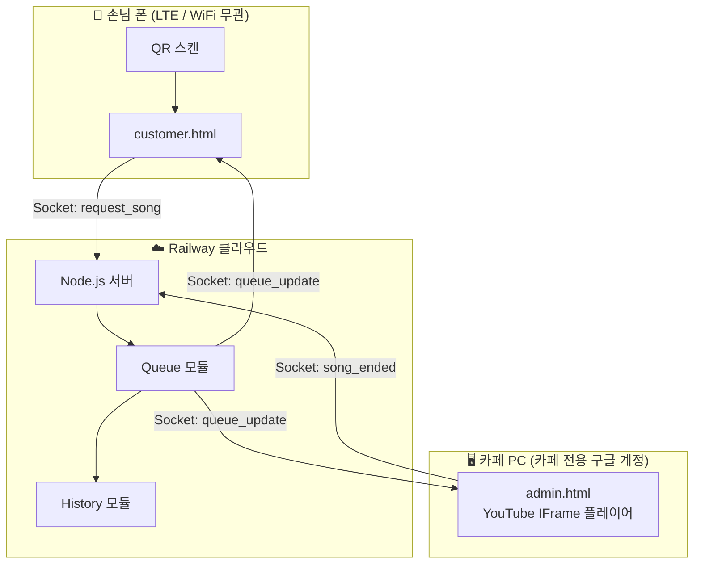
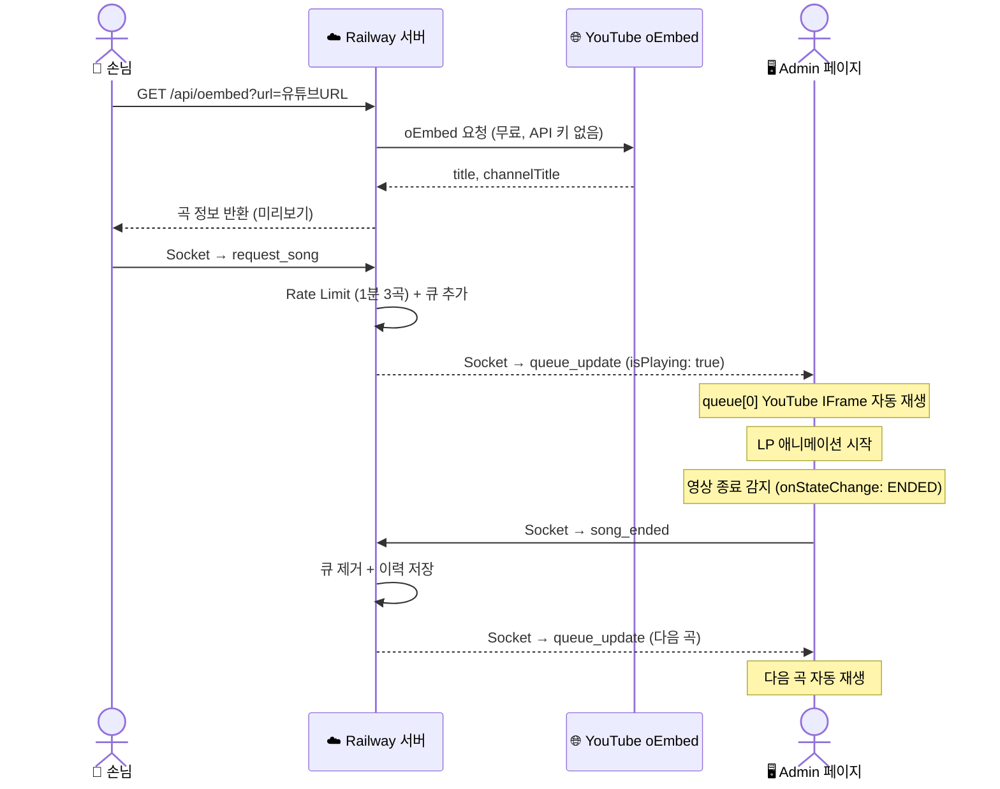
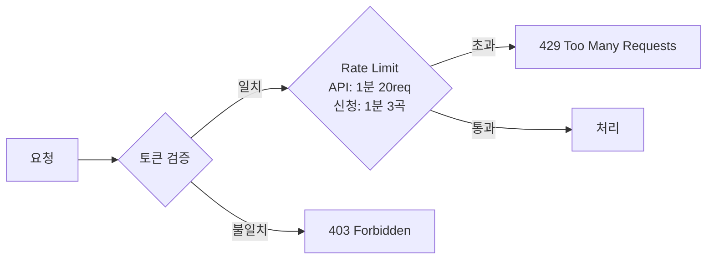

# ☕ Caffeine Flow

> 카페 손님이 QR 코드를 스캔해 YouTube URL로 음악을 신청하면, Admin 페이지에서 자동으로 재생되는 뮤직 리퀘스트 시스템

---

## 목차

- [주요 기능](#주요-기능)
- [시스템 아키텍처](#시스템-아키텍처)
- [프로젝트 구조](#프로젝트-구조)
- [기술 스택](#기술-스택)
- [실행 방법](#실행-방법)
- [Railway 배포](#railway-배포)
- [화면 구성](#화면-구성)
- [보안](#보안)
- [향후 계획](#향후-계획)

---

## 주요 기능

| 기능 | 설명 |
|------|------|
| 🔗 URL 신청 | YouTube URL 붙여넣기 → 곡 정보 자동 조회 후 신청 |
| 📡 실시간 동기화 | Socket.io로 신청 즉시 모든 화면에 반영 |
| 🎬 자동 재생 | Admin 페이지 YouTube IFrame에서 순서대로 자동 재생 |
| 🔁 자동 다음 곡 | 곡 종료 시 자동으로 다음 신청 곡 재생 |
| 💿 LP 애니메이션 | 재생 중 회전하는 LP판 + 앨범아트 표시 |
| ⏭ 스킵 / 삭제 | 관리자가 곡을 강제 스킵하거나 큐에서 제거 |
| 🔛 시스템 ON/OFF | 손님 신청 기능을 즉시 켜고 끄기 |
| 🔒 토큰 + Rate Limit | 무작위 접근 및 스팸 신청 차단 |
| 📊 이력 & 통계 | 재생 이력 저장, TOP 10 신청곡, 시간대별 통계 |

---

## 시스템 아키텍처

### 전체 구조



---

### 신청부터 재생까지 (Sequence)



---

### 보안 흐름



---

## 프로젝트 구조

```
caffeine-Flow/
├── server.js              # 진입점
├── railway.json           # Railway 배포 설정
├── src/
│   ├── config.js          # 환경변수
│   ├── state.js           # 공유 상태 (queue, isPlaying 등)
│   ├── queue.js           # 큐 로직 (추가/스킵/삭제/재생)
│   ├── history.js         # 이력 저장 & 통계 (인메모리 캐시)
│   ├── api.js             # REST API 라우터 (Rate Limit 포함)
│   └── socket.js          # Socket.io 핸들러 (신청 Rate Limit 포함)
├── public/
│   ├── customer.html      # 손님 모바일 페이지
│   ├── admin.html         # 관리자 페이지 (플레이어 + 큐/이력/통계)
│   └── utils.js           # 공통 유틸 (escHtml)
├── data/
│   └── history.json       # 재생 이력 (자동 생성, git 제외)
└── .env                   # 환경변수 (git 제외)
```

---

## 기술 스택

| 분류 | 기술 |
|------|------|
| **런타임** | Node.js |
| **서버 프레임워크** | Express |
| **실시간 통신** | Socket.io |
| **프론트엔드** | Vanilla HTML/CSS/JS |
| **곡 정보 조회** | YouTube oEmbed API (무료, API 키 불필요) |
| **음악 재생** | YouTube IFrame Player API |
| **Rate Limiting** | express-rate-limit |
| **이력 저장** | JSON 파일 + 인메모리 캐시 |
| **배포** | Railway |

---

## 실행 방법

### 사전 준비

- [Node.js 18+](https://nodejs.org) 설치

### 1. 저장소 클론 & 의존성 설치

```bash
git clone https://github.com/sngmng6506/caffeine-Flow.git
cd caffeine-Flow
npm install
```

### 2. 환경변수 설정

```bash
cp .env.example .env
```

`.env` 파일 수정:

```env
PORT=3000
CAFE_TOKEN=your-random-token-here
```

토큰 랜덤 생성:
```bash
node -e "console.log(require('crypto').randomBytes(16).toString('hex'))"
```

### 3. 서버 실행

```bash
# 일반 실행
node server.js

# 개발 모드 (파일 변경 시 자동 재시작)
npm run dev
```

서버 시작 시 콘솔 출력:
```
🎵 Caffeine Flow running on http://localhost:3000
   Customer: http://localhost:3000/customer.html?token=토큰
   Admin:    http://localhost:3000/admin.html?token=토큰
```

### 4. 접속

| 역할 | URL |
|------|-----|
| **관리자 (카페 PC)** | `http://localhost:3000/admin.html?token=토큰` |
| **손님 테스트** | `http://localhost:3000/customer.html?token=토큰` |

> 카페 네트워크에서 손님이 접속하려면 `localhost` 대신 **PC의 로컬 IP** 사용
> ```bash
> # Windows - 로컬 IP 확인
> ipconfig
> # → IPv4 주소 (예: 192.168.0.10)
> ```
> 손님 URL: `http://192.168.0.10:3000/customer.html?token=토큰`

### 5. 사용 흐름

**손님:**
1. QR 스캔 (또는 URL 직접 접속)
2. YouTube 앱에서 원하는 곡 찾기 → 공유 → URL 복사
3. 신청 페이지에 URL 붙여넣기 → 미리보기 확인 → 신청

**관리자 (카페 PC):**
1. 카페 전용 구글 계정으로 YouTube 로그인
2. Admin 페이지 접속 → 손님 신청 즉시 자동 재생
3. 필요 시 스킵 / 삭제 / 시스템 ON·OFF

---

## Railway 배포

### 1. 프로젝트 생성
1. [railway.app](https://railway.app) → GitHub 로그인
2. **New Project** → **Deploy from GitHub repo** → `caffeine-Flow` 선택

### 2. 환경변수 설정
Railway 대시보드 → **Variables** 탭:
```
CAFE_TOKEN = (랜덤 생성한 토큰)
```

### 3. 배포 확인
- `main` 브랜치 push 시 자동 배포
- 도메인 자동 발급: `https://caffeine-flow-xxxx.railway.app`

### 4. QR 코드 생성
아래 URL로 QR 생성 후 카페 테이블에 부착:
```
https://caffeine-flow-xxxx.railway.app/customer.html?token=토큰
```

### 5. Admin 접속
카페 PC에서 카페 전용 구글 계정으로 YouTube 로그인 후:
```
https://caffeine-flow-xxxx.railway.app/admin.html?token=토큰
```

> **카페 전용 구글 계정 사용 권장** — 개인 시청 기록 오염 방지 및 계정 피해 범위 분리

---

## 화면 구성

### 손님 화면 (Mobile)
- YouTube URL 붙여넣기 → 곡 미리보기 → 신청
- 현재 신청 목록 실시간 확인
- 시스템 OFF / Rate Limit 초과 시 안내 메시지

### 관리자 화면 (PC)

| 영역 | 내용 |
|------|------|
| 왼쪽 | LP 애니메이션, YouTube IFrame 플레이어, 스킵 / 시스템 ON·OFF |
| 신청 목록 탭 | 현재 큐, 개별 삭제 |
| 이력 탭 | 재생/스킵 곡 목록 + 시간 기록 |
| 통계 탭 | 전체 신청 수, 재생 완료, 스킵률, 시간대별 차트, TOP 10 |

---

## 보안

| 방법 | 내용 |
|------|------|
| **랜덤 토큰** | 추측 불가능한 토큰으로 무작위 접근 차단 |
| **API Rate Limit** | IP당 1분 20요청 제한 |
| **신청 Rate Limit** | IP당 1분 3곡 신청 제한 (메모리 누수 방지 자동 정리) |
| **카페 전용 계정** | 개인 구글 계정 분리 권장 |

---

## 향후 계획

- [ ] 테이블별 고유 QR 코드 생성
- [ ] 좋아요 / 투표 기반 큐 정렬
- [ ] PostgreSQL로 이력 영속성 개선 (Railway 재배포 후 데이터 유지)
