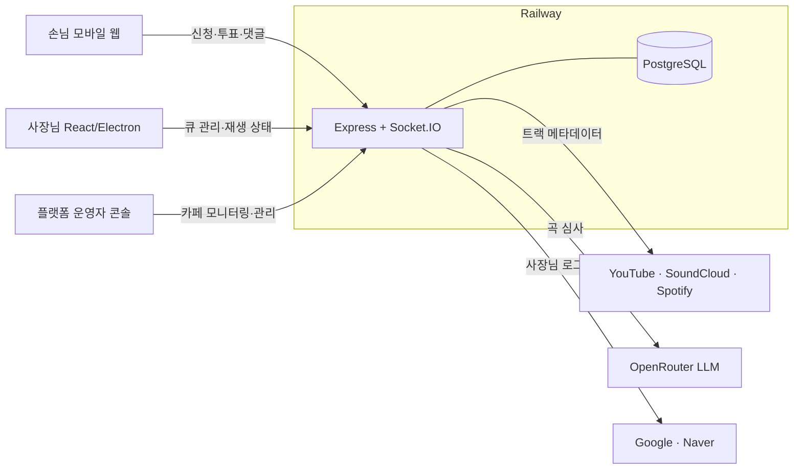
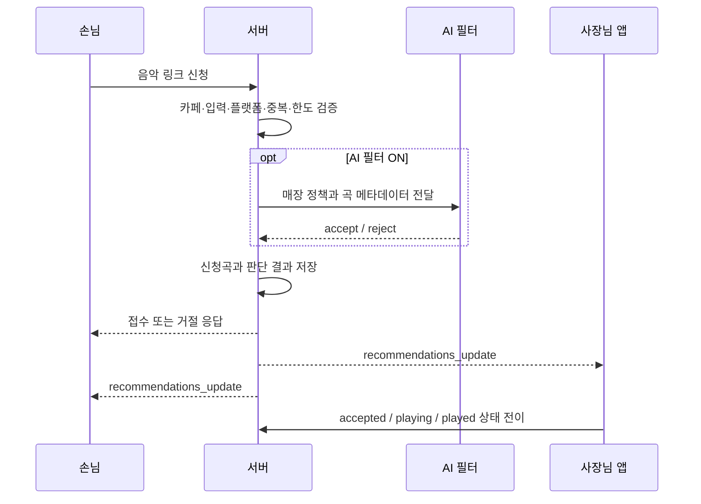
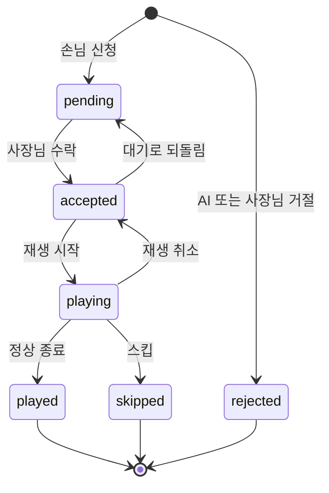

# 아키텍처

> **AI가 읽을 때:** 시스템 경계, 앱별 책임, 데이터 흐름, 인증 경계, 추천곡 상태 모델을 변경할 때
> **함께 갱신할 때:** 컴포넌트 책임·상태 전이·영속 상태의 단일 원천이 달라질 때
> **생략 가능한 경우:** 기존 경계 안에서 함수·컴포넌트만 분리하는 내부 리팩터링

이 문서는 코드를 읽기 전에 Caffeine Flow의 시스템 경계와 데이터 흐름을 이해하기 위한 것이다.

- Electron 재생 엔진: [PLAYBACK.md](PLAYBACK.md)
- API 경로: [API.md](API.md)
- AI 음악 필터: [LLM_FILTER.md](LLM_FILTER.md)
- 개발·배포: [DEVELOPMENT.md](DEVELOPMENT.md)

## 시스템 구성



손님과 사장님 앱은 서로 직접 통신하지 않는다. 모든 상태 변경은 서버에 저장된 뒤 카페별 Socket.IO room으로 전파된다.

## 애플리케이션 경계

| 영역 | 책임 |
| --- | --- |
| `customer/` | 손님용 SPA, 신청·투표·댓글·큐 조회 |
| `owner/src/` | 사장님 UI, 큐 상태 전이와 운영 설정 |
| `owner/electron/` | 창 관리, 실제 음악 재생, 종료 감지 |
| `admin/` | 플랫폼 운영자용 카페 모니터링·정지·삭제 UI |
| `server/` | 인증, 검증, 영속화, 실시간 이벤트, 통계, AI 판단 |

서버는 판단과 데이터 일관성을 책임지고, Electron 앱은 실제 외부 플랫폼 재생을 책임진다.

## 신청곡 흐름



LLM이 `accept`해도 서버의 일반 큐 상태는 `pending`이다. 자동수락과 실제 재생 전환은 사장님 앱이 처리한다.

## Recommendation Status Contract



핵심 규칙:

- 활성 상태는 `pending`, `accepted`, `playing`이다.
- 종료 상태는 `played`, `skipped`, `rejected`이며 다시 활성 상태로 돌리지 않는다.
- 같은 카페·같은 곡은 활성 상태로 동시에 두 개 존재할 수 없다.
- 상태 전이의 실제 허용 범위는 서버 상태 전이 정책이 기준이다.

변경 시 [AI_CHANGE_GUARDRAILS.md](AI_CHANGE_GUARDRAILS.md#recommendation-status-contract)를 먼저 확인한다.

## 실시간 동기화

카페별 Socket.IO room을 사용한다.

```text
손님 추가·투표·취소
→ 서버 트랜잭션
→ DB 반영
→ recommendations_update
→ 손님·사장님 화면 갱신
```

재연결 시 클라이언트는 서버에서 현재 큐를 다시 조회한다. 소켓 이벤트만으로 영구 상태를 복원하지 않는다.

정지되거나 존재하지 않는 카페는 손님 HTTP 요청과 소켓 입장을 모두 차단한다. 검증된 사장님 연결은 운영 복구를 위해 유지할 수 있다.

## 인증 경계

- 사장님: Google/Naver 로그인 후 JWT
- 신규 가입: 제한시간이 있는 pending token으로 가입 완료
- 운영자: `role=admin` 전용 토큰과 별도 미들웨어
- 손님: 계정 없이 `visitor_id`와 IP를 요청 제한·본인 취소에 사용

사장님 토큰과 운영자 토큰은 같은 권한으로 취급하지 않는다.

## 데이터 모델

| 테이블 | 역할 |
| --- | --- |
| `cafes` | 카페 계정, slug, 운영 설정, AI 필터 정책, 하트비트 |
| `recommendations` | 신청곡, 일반 상태, AI 판단, 신청·재생 시각 |
| `votes` | 곡별 투표와 중복 방지 |
| `comments` | 개별 신청곡에 달린 댓글 |
| `song_comments` | 같은 곡을 카페 간 공유하는 댓글과 답글 |
| `cafe_visits` | 카페·IP·KST 날짜 기준 방문 집계 |
| `daily_stats` | KST 기준 운영 통계와 피크 동시접속 |
| `cafe_slug_history` | QR slug 변경 이력과 이전 주소 이동 안내 |

`recommendations.id`는 UUID다. UUID의 순서를 가정한 `MIN/MAX(id)` 집계는 사용하지 않는다.

## 시간 기준

사용자에게 보이는 날짜·이력·통계의 하루 경계는 KST다. 서버와 사장님 UI는 공통 KST 유틸을 사용하며 UTC 자정을 직접 계산하지 않는다.

## 배포 경계

- 서버와 두 SPA: Railway 단일 서비스
- PostgreSQL: Railway 연결 DB
- Electron 설치 파일: GitHub Release

자세한 명령과 환경변수는 [DEVELOPMENT.md](DEVELOPMENT.md), Electron 업데이트 동작은 [PLAYBACK.md](PLAYBACK.md)를 참고한다.
