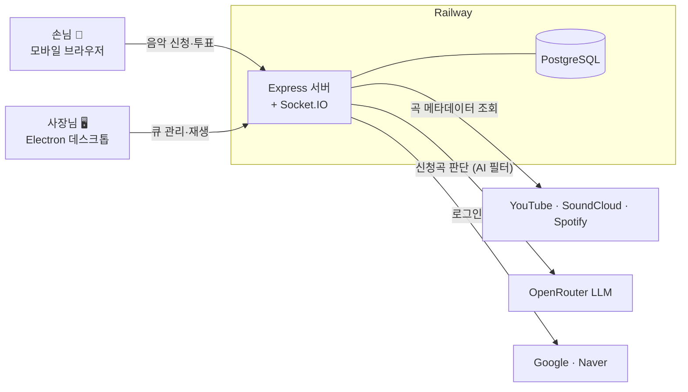
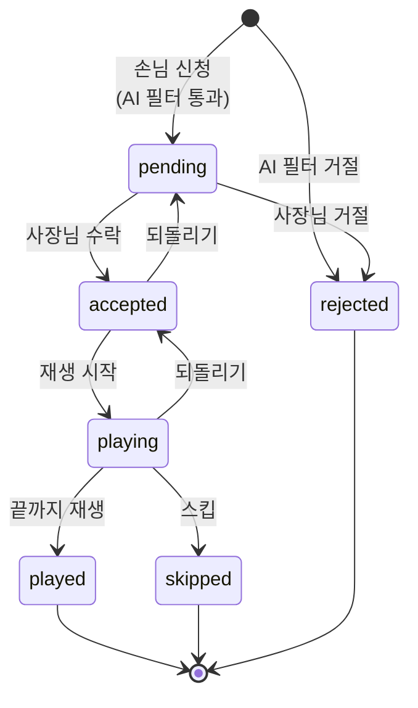
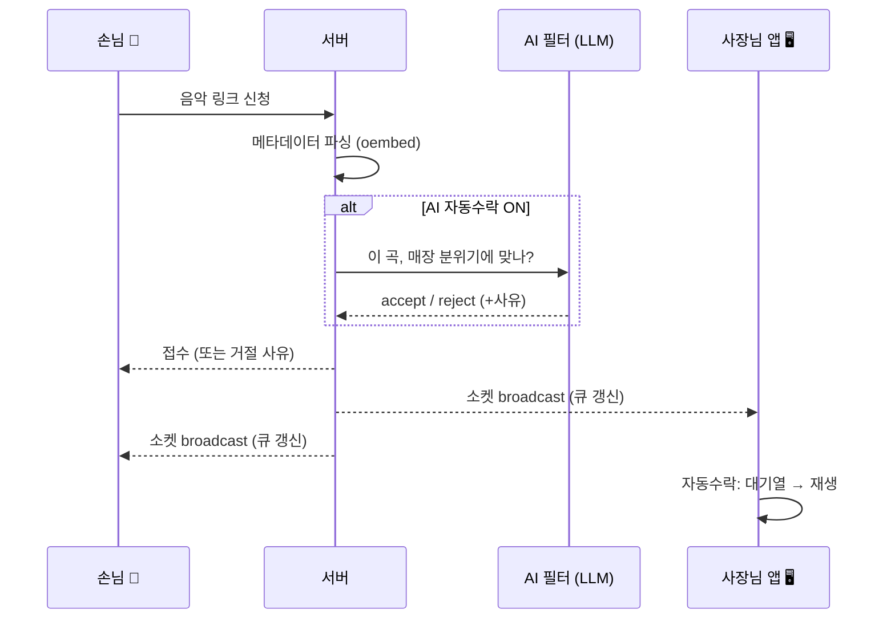
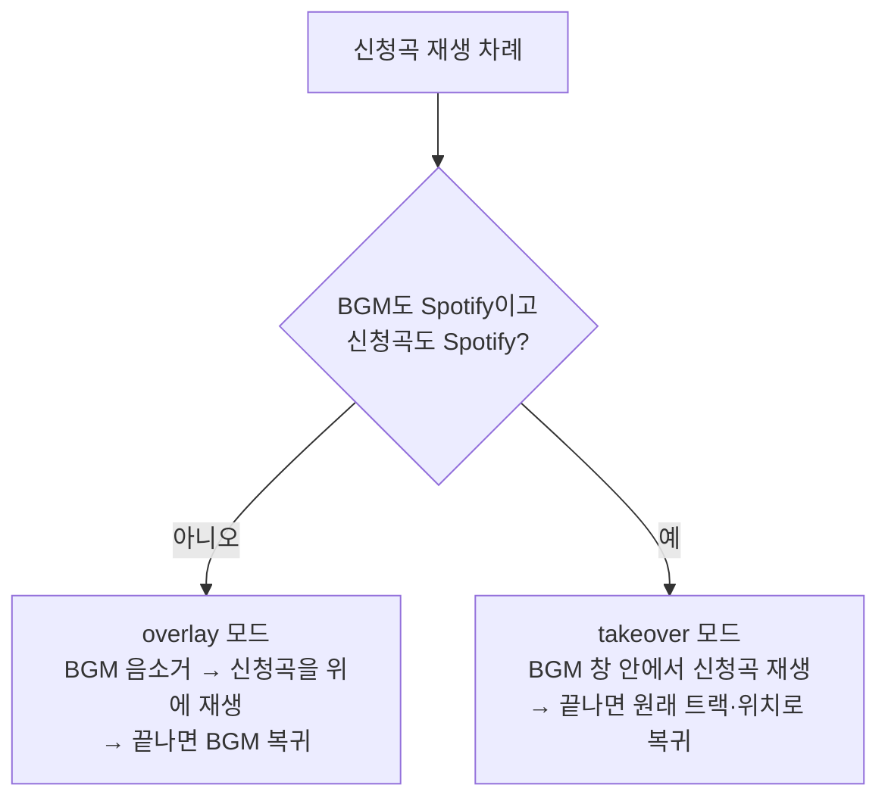
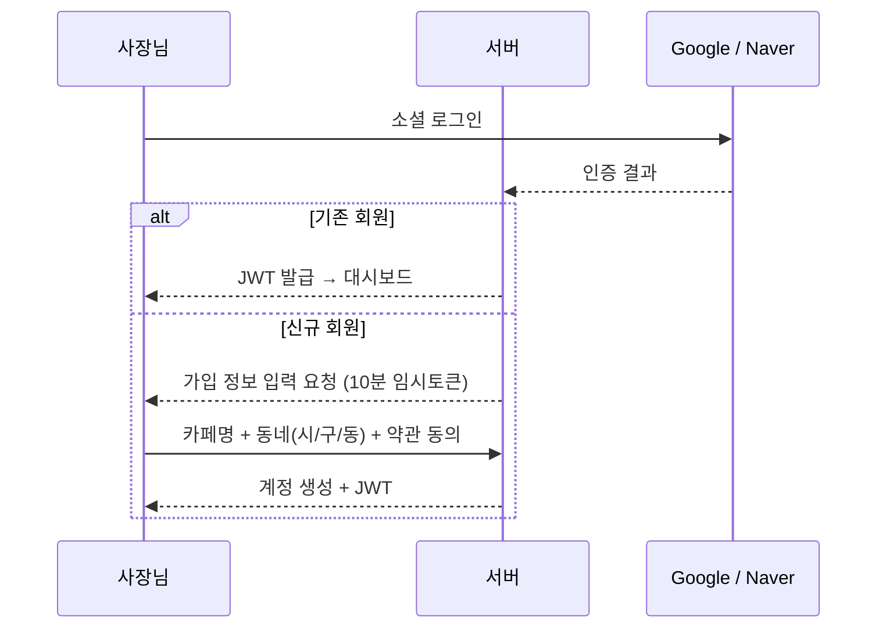
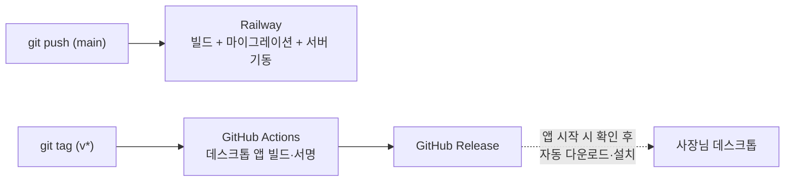

# 아키텍처

**이 문서는 코드를 읽지 않고도 Caffeine Flow의 작동 원리를 이해하기 위한 것이다.**
AI 협업 규칙은 [../AGENTS.md](../AGENTS.md), 엔드포인트 목록은 [API.md](API.md), LLM 기능 설계는 [LLM_FEATURES.md](LLM_FEATURES.md)에 있다.

---

## 1. 시스템 전경

세 개의 앱과 하나의 서버로 구성된다. 손님은 설치 없이 모바일 브라우저로, 사장님은 데스크톱 앱으로 접속하며, 모든 상태는 서버(단일 Railway 배포)에 모인다.



핵심 설계 하나로 요약하면: **손님과 사장님은 서로 직접 통신하지 않는다.** 모든 변화(신청·수락·재생)는 서버를 거쳐 Socket.IO로 같은 카페 room에 실시간 전파된다.

---

## 2. 신청곡의 한살이

신청곡 하나는 아래 상태를 오간다. 이 상태 기계가 서비스의 중심 데이터 모델이다.



알아둘 규칙 두 가지:
- **종료 상태(played·skipped·rejected)에서는 되돌릴 수 없다.** 서버가 역방향 전이를 거부한다(통계 오염 방지).
- **같은 곡은 활성 상태(pending·accepted·playing)로 동시에 두 번 존재할 수 없다.** DB 유니크 제약이 동시 신청 경쟁까지 막는다. 곡이 끝난 뒤의 재신청은 허용된다.

---

## 3. 신청 → 재생까지의 실시간 흐름

손님이 링크를 붙여넣는 순간부터 매장에 음악이 나오기까지:



- **AI 필터**는 사장님이 자연어로 적은 매장 분위기("조용한 재즈 위주, 욕설 없는 곡")를 기준으로 LLM이 accept/reject를 판단하는 운영 안전장치다. 꺼져 있으면 모든 신청이 pending으로 들어와 수동 운영이 된다. 상세 설계는 [LLM_FEATURES.md](LLM_FEATURES.md).
- LLM이 accept한 곡도 서버에는 **pending으로 저장**된다 — 실제 수락·재생 진행은 사장님 앱 클라이언트가 처리한다(서버는 판단만, 진행은 앱이).

---

## 4. 재생 파이프라인 (사장님 데스크톱)

사장님 앱의 본질은 **크롬 창 두 개를 겹쳐 놓은 것**이다. 아래(bgmView)에는 매장 BGM이 항상 흐르고, 신청곡이 오면 위(recView)에 잠깐 얹었다가 끝나면 치운다.



takeover가 따로 있는 이유: **Spotify Connect는 계정당 재생 세션을 하나만 허용**해서, 두 창에서 동시에 Spotify를 틀면 서로 끊어버린다. 그래서 이 조합일 때만 한 창 안에서 곡을 갈아끼운다.

### 곡이 끝났는지 어떻게 아는가

플랫폼마다 "끝"의 신호가 다르다. 이 감지가 자동 진행(다음 곡)의 핵심이다.

| 플랫폼 | 감지 방식 | 이유 |
| --- | --- | --- |
| YouTube | `<video>` ended 이벤트 | 표준 이벤트가 정상 동작 |
| Spotify | 트랙 제목 시그니처가 연속 2회 변경되면 종료로 판정 | 자체 autoplay로 다음 곡을 이어 틀어서 ended가 안 뜸 |
| SoundCloud | Spotify와 같은 시그니처 방식 | 같은 이유 |

### 플랫폼과의 신경전 (알아두면 좋은 제약)

- **SoundCloud 자동재생** — 스크립트로 만든 클릭(`.click()`)은 SoundCloud가 무시한다. 그래서 운영체제 수준의 진짜 마우스 입력(`isTrusted=true`)을 합성해서 재생 버튼을 누른다.
- **SoundCloud 로그인 모달** — 재생을 가로막는 로그인 팝업 요청을 네트워크 단계에서 차단하고, 그래도 뜨는 모달은 CSS로 숨긴다.
- **봇 감지(DataDome)** — 자동화 도구로 오인받지 않도록 브라우저 지문(webdriver 플래그, WebGL 등)을 일반 브라우저처럼 위장한다.

---

## 5. 로그인과 가입



- 세션은 **JWT(30일)** 하나로 관리하고, 사장님 API와 소켓 양쪽에서 같은 토큰을 검증한다.
- 위치는 **동 단위까지만** 받는다 — 용도가 "손님이 지역으로 매장을 발견"이라 정밀 주소가 불필요하고, 최소수집 원칙에도 맞다.
- Naver 콜백은 토큰을 URL fragment(#)로 전달한다 — 서버 로그·Referer에 토큰이 남지 않게.

---

## 6. 배포와 자동 업데이트



- **서버**: main에 push하면 Railway가 customer·owner SPA를 빌드하고, DB 마이그레이션을 돌린 뒤 서버를 띄운다. 사장님 데스크톱 앱의 화면(UI)도 이 서버에서 로드하므로, **UI 변경은 서버 배포만으로 즉시 반영**된다.
- **데스크톱 앱 본체**(재생 엔진·창 관리)는 버전 태그를 push하면 CI가 빌드·서명해 GitHub Release로 배포하고, 실행 중인 앱이 이를 감지해 자동 업데이트한다.

---

## 7. 데이터 모델 (요약)

```
cafes            카페 계정 — slug(QR 주소), 동네(시/구/동), 허용 플랫폼,
                 AI 필터 설정(ON/OFF·분위기 프롬프트·강도), 약관 동의 시각들
recommendations  신청곡 — 상태(2장의 상태 기계), 플랫폼, 신청자 식별(IP·기기값),
                 AI 필터 판단 결과(사유·확신도), 재생 시각·길이
votes            곡 투표 — (곡, IP) 유니크로 중복 차단
comments         곡별 댓글·답글
daily_stats      일별 피크 동시접속 (KST 기준)
cafe_visits      방문 집계 — (카페, IP, KST 날짜) 유니크로 하루 1회
```

시간 관련 데이터는 전부 **KST 기준**으로 집계한다 — 통계 화면과 이력 필터가 같은 "하루"를 보도록.
